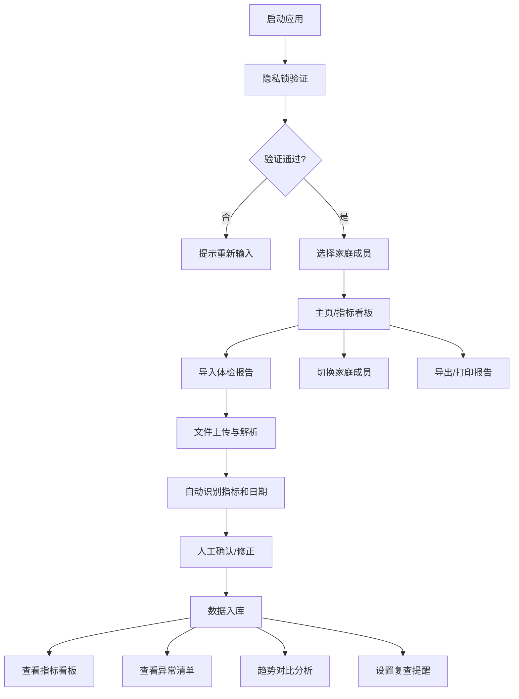

## 1. 产品概述

本地健康管理自动化工具，帮助个人用户整理和分析多年体检报告数据，实现健康数据的数字化管理和可视化分析。

- **核心价值**：解决纸质/零散体检报告难以长期保存、对比分析和异常追踪的痛点
- **目标用户**：需要整理多年体检资料的个人及家庭用户
- **部署方式**：纯本地Web应用，数据存储在本地浏览器，保障隐私安全

## 2. 核心功能

### 2.1 用户角色

| 角色 | 注册方式 | 核心权限 |
|------|---------|---------|
| 家庭管理员 | 本地创建密码 | 管理所有家庭成员数据、设置隐私锁 |
| 普通成员 | 管理员添加 | 查看和编辑本人健康数据 |

### 2.2 功能模块

1. **隐私锁模块**：应用启动密码验证，数据加密存储
2. **导入模块**：批量上传报告文件、按姓名自动归档、智能识别检查日期
3. **项目识别模块**：自动归并同类指标、标记参考范围外结果、支持手动修正名称
4. **指标看板模块**：最新体检数据概览、关键指标卡片展示
5. **异常清单模块**：异常指标汇总、历史异常追踪
6. **趋势对比模块**：血压/血脂/血糖曲线图、历年数据对比分析
7. **提醒模块**：医生建议记录、复查提醒设置、用药备注管理
8. **家庭成员模块**：成员管理、快速切换、独立数据隔离
9. **导出模块**：打印健康摘要、导出Excel表格

### 2.3 页面详情

| 页面名称 | 模块名称 | 功能描述 |
|---------|---------|---------|
| 登录/解锁页 | 隐私锁 | 密码验证、忘记密码重置 |
| 主页/指标看板 | 指标看板 | 关键指标概览、最新体检数据、快速操作入口 |
| 导入页面 | 导入模块 | 拖拽上传、文件列表、姓名分配、日期识别确认 |
| 数据管理页 | 项目识别 | 指标列表、手动修正、异常标记、参考范围维护 |
| 异常清单页 | 异常清单 | 异常指标分类、历史记录、异常变化追踪 |
| 趋势分析页 | 趋势对比 | 多维度曲线图、时间范围选择、指标对比 |
| 提醒管理页 | 提醒模块 | 医生建议、复查日历、用药备注 |
| 成员管理页 | 家庭成员 | 成员列表、添加/编辑成员、切换当前成员 |
| 导出页面 | 导出模块 | 摘要预览、打印、Excel导出 |

## 3. 核心流程

## 4. 用户界面设计

### 4.1 设计风格

- **主色调**：医疗蓝 `#1677ff`（专业、可信）
- **辅助色**：健康绿 `#52c41a`（正常）、警告橙 `#faad14`（偏高）、危险红 `#ff4d4f`（异常）
- **字体**：显示字体使用 Noto Sans SC，正文字体使用系统字体栈
- **布局风格**：卡片式布局，清晰的区域划分，顶部导航栏 + 侧边菜单
- **图标风格**：线性图标（lucide-react），简洁现代
- **按钮风格**：圆角8px，悬停有轻微阴影和颜色变化
- **数据可视化**：使用渐变色彩的平滑曲线图，异常点高亮显示

### 4.2 页面设计概述

| 页面名称 | 模块名称 | UI元素 |
|---------|---------|--------|
| 登录页 | 隐私锁 | 居中卡片、密码输入框、锁图标、品牌标识 |
| 主页 | 指标看板 | 顶部导航、成员切换、指标卡片网格、异常提醒横幅、快捷操作区 |
| 导入页 | 导入模块 | 拖拽上传区域、文件列表表格、姓名选择器、日期修正弹窗 |
| 数据管理页 | 项目识别 | 搜索筛选栏、指标数据表格、可编辑单元格、批量操作工具栏 |
| 异常清单页 | 异常清单 | 分类标签页（近期异常/历史异常）、异常卡片、趋势微图表 |
| 趋势分析页 | 趋势对比 | 图表选择器、时间范围过滤、主图表区域、数据对比表格 |
| 提醒管理页 | 提醒模块 | 日历视图、建议列表、用药备注卡片 |
| 成员管理页 | 家庭成员 | 成员头像卡片、添加成员表单、权限设置 |
| 导出页 | 导出模块 | 报告预览区、打印按钮、导出格式选择 |

### 4.3 响应式

- **Desktop-first**：针对桌面端优化设计，支持1280px及以上分辨率
- **移动端适配**：在768px以下自动调整布局，侧边栏转为底部标签栏
- **触摸优化**：按钮最小尺寸44px，确保触摸友好

### 4.4 动画与交互

- 页面加载使用淡入动画，内容区域错落出现
- 数据卡片悬停时轻微上浮并增加阴影
- 图表数据点悬停显示详细信息Tooltip
- 侧边菜单展开/收起使用平滑过渡
- 表单提交有加载状态和成功/失败反馈
