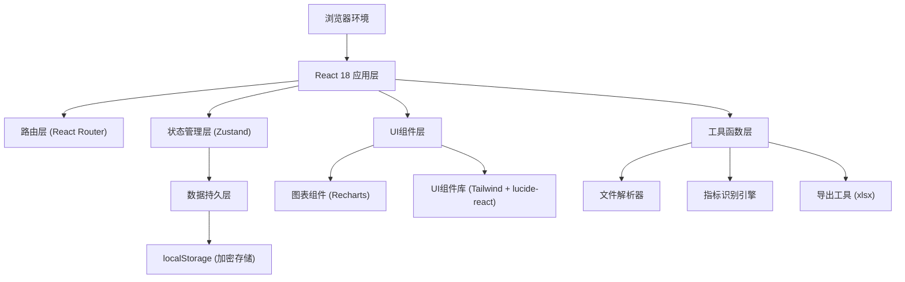
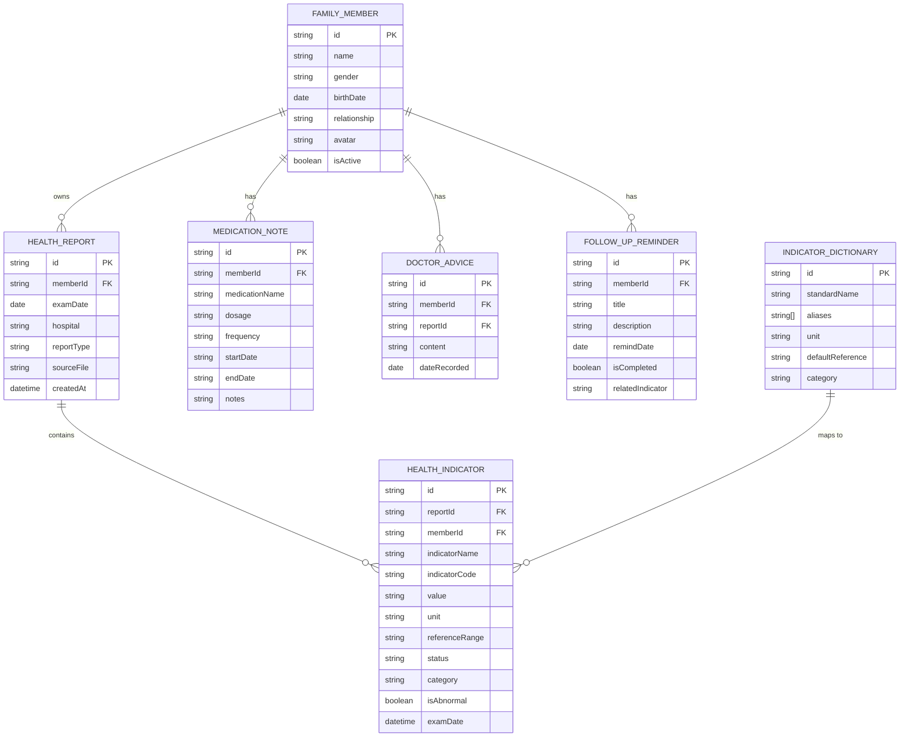

## 1. 架构设计



## 2. 技术描述

- **前端框架**：React@18 + TypeScript + Vite@5
- **样式方案**：TailwindCSS@3
- **状态管理**：Zustand
- **路由管理**：React Router DOM@6
- **图表库**：Recharts
- **图标库**：lucide-react
- **Excel导出**：xlsx
- **日期处理**：date-fns
- **数据存储**：浏览器 localStorage（AES加密）
- **初始化工具**：vite-init
- **后端**：无（纯前端本地应用）
- **数据库**：无（使用 localStorage 存储）

## 3. 路由定义

| 路由 | 页面组件 | 权限要求 | 功能说明 |
|------|---------|---------|---------|
| `/login` | `LoginPage` | 公开 | 隐私锁验证页面 |
| `/` | `DashboardPage` | 已登录 | 指标看板主页 |
| `/import` | `ImportPage` | 已登录 | 报告导入页面 |
| `/data` | `DataManagementPage` | 已登录 | 数据管理与指标识别 |
| `/abnormal` | `AbnormalListPage` | 已登录 | 异常清单页面 |
| `/trend` | `TrendAnalysisPage` | 已登录 | 趋势对比分析页面 |
| `/reminders` | `RemindersPage` | 已登录 | 提醒管理页面 |
| `/family` | `FamilyPage` | 已登录 | 家庭成员管理 |
| `/export` | `ExportPage` | 已登录 | 导出与打印页面 |
| `/settings` | `SettingsPage` | 已登录 | 隐私锁与系统设置 |

## 4. 数据模型

### 4.1 实体关系图



### 4.2 TypeScript 类型定义

```typescript
// 家庭成员
interface FamilyMember {
  id: string;
  name: string;
  gender: 'male' | 'female';
  birthDate: string;
  relationship: string;
  avatar?: string;
  isActive: boolean;
  createdAt: string;
}

// 体检报告
interface HealthReport {
  id: string;
  memberId: string;
  examDate: string;
  hospital: string;
  reportType: string;
  sourceFileName?: string;
  createdAt: string;
}

// 健康指标
interface HealthIndicator {
  id: string;
  reportId: string;
  memberId: string;
  indicatorName: string;
  indicatorCode?: string;
  value: string;
  numericValue?: number;
  unit: string;
  referenceRange: string;
  minValue?: number;
  maxValue?: number;
  status: 'normal' | 'high' | 'low' | 'critical';
  category: string;
  isAbnormal: boolean;
  examDate: string;
}

// 指标词典（用于名称归一化）
interface IndicatorDictionary {
  id: string;
  standardName: string;
  aliases: string[];
  unit: string;
  defaultReference: string;
  category: string;
}

// 用药备注
interface MedicationNote {
  id: string;
  memberId: string;
  medicationName: string;
  dosage: string;
  frequency: string;
  startDate: string;
  endDate?: string;
  notes?: string;
  isActive: boolean;
}

// 医生建议
interface DoctorAdvice {
  id: string;
  memberId: string;
  reportId?: string;
  content: string;
  dateRecorded: string;
}

// 复查提醒
interface FollowUpReminder {
  id: string;
  memberId: string;
  title: string;
  description?: string;
  remindDate: string;
  isCompleted: boolean;
  relatedIndicator?: string;
}

// 应用状态
interface AppState {
  isLocked: boolean;
  currentMemberId: string | null;
  encryptionKey?: string;
}
```

## 5. 核心模块设计

### 5.1 导入模块

- **文件上传**：支持拖拽上传，批量处理
- **格式支持**：PDF、图片（OCR）、纯文本
- **姓名识别**：从文件名/内容中提取姓名，自动匹配家庭成员
- **日期识别**：正则匹配多种日期格式（YYYY-MM-DD、YYYY/MM/DD、YYYY年MM月DD日）
- **指标解析**：基于词典和正则表达式提取指标名称、数值、单位、参考范围

### 5.2 指标识别模块

- **名称归一化**：基于词典匹配，将别名映射到标准名称
- **异常判断**：解析参考范围，自动判断指标状态
- **手动修正**：支持编辑指标名称、数值、参考范围
- **批量合并**：相似指标智能合并建议

### 5.3 趋势分析模块

- **图表类型**：折线图、面积图、柱状图
- **支持指标**：血压（收缩压/舒张压）、血糖（空腹/餐后）、血脂（总胆固醇/甘油三酯/高密度脂蛋白/低密度脂蛋白）
- **时间范围**：近1年、近3年、近5年、全部
- **对比功能**：同期对比、历年对比

### 5.4 隐私保护模块

- **密码锁**：AES加密存储数据，启动需验证密码
- **数据加密**：所有敏感数据在 localStorage 中加密存储
- **自动锁定**：闲置一段时间后自动锁定
